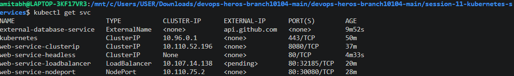

# Clusterip_1:

<pre style="background-color: #1e1e2e; color: #cdd6f4; padding: 16px; border-radius: 8px; font-family: 'Consolas', 'Courier New', monospace; font-size: 13.5px; line-height: 1.45; overflow-x: auto; border: 1px solid #313244;"><code>amitabh@LAPTOP-3KF17VR3:/mnt/c/Users/USER/Downloads/devops-heros-branch10104-main/devops-heros-branch10104-main/session-11-kubernetes-services$ kubectl apply -f 01-clusterip/app-deployment.yaml
deployment.apps/web-app-clusterip created
amitabh@LAPTOP-3KF17VR3:/mnt/c/Users/USER/Downloads/devops-heros-branch10104-main/devops-heros-branch10104-main/session-11-kubernetes-services$ kubectl get pods -l app=web-clusterip -o wide
NAME                                 READY   STATUS    RESTARTS   AGE   IP           NODE       NOMINATED NODE   READINESS GATES
web-app-clusterip-66865d4855-6lzmj   1/1     Running   0          31s   10.244.0.4   minikube   &lt;none&gt;           &lt;none&gt;
web-app-clusterip-66865d4855-crmq4   1/1     Running   0          31s   10.244.0.5   minikube   &lt;none&gt;           &lt;none&gt;
web-app-clusterip-66865d4855-xngb2   1/1     Running   0          31s   10.244.0.3   minikube   &lt;none&gt;           &lt;none&gt;
amitabh@LAPTOP-3KF17VR3:/mnt/c/Users/USER/Downloads/devops-heros-branch10104-main/devops-heros-branch10104-main/session-11-kubernetes-services$ kubectl apply -f 01-clusterip/service.yaml
service/web-service-clusterip created
amitabh@LAPTOP-3KF17VR3:/mnt/c/Users/USER/Downloads/devops-heros-branch10104-main/devops-heros-branch10104-main/session-11-kubernetes-services$ kubectl get svc web-service-clusterip
NAME                    TYPE        CLUSTER-IP      EXTERNAL-IP   PORT(S)    AGE
web-service-clusterip   ClusterIP   10.110.52.196   &lt;none&gt;        8080/TCP   17s
amitabh@LAPTOP-3KF17VR3:/mnt/c/Users/USER/Downloads/devops-heros-branch10104-main/devops-heros-branch10104-main/session-11-kubernetes-services$ kubectl get endpoints web-service-clusterip
Warning: v1 Endpoints is deprecated in v1.33+; use discovery.k8s.io/v1 EndpointSlice
NAME                    ENDPOINTS                                   AGE
web-service-clusterip   10.244.0.3:80,10.244.0.4:80,10.244.0.5:80   3m11s
amitabh@LAPTOP-3KF17VR3:/mnt/c/Users/USER/Downloads/devops-heros-branch10104-main/devops-heros-branch10104-main/session-11-kubernetes-services$ kubectl apply -f 01-clusterip/client-pod.yaml
pod/curl-client created
amitabh@LAPTOP-3KF17VR3:/mnt/c/Users/USER/Downloads/devops-heros-branch10104-main/devops-heros-branch10104-main/session-11-kubernetes-services$ kubectl get pod curl-client
NAME          READY   STATUS    RESTARTS   AGE
curl-client   1/1     Running   0          12s
amitabh@LAPTOP-3KF17VR3:/mnt/c/Users/USER/Downloads/devops-heros-branch10104-main/devops-heros-branch10104-main/session-11-kubernetes-services$ kubectl exec -it curl-client -- curl -s http://web-service-clusterip:8080
&lt;!DOCTYPE html&gt;
&lt;html&gt;
&lt;head&gt;
&lt;title&gt;Welcome to nginx!&lt;/title&gt;
&lt;style&gt;
html { color-scheme: light dark; }
body { width: 35em; margin: 0 auto;
font-family: Tahoma, Verdana, Arial, sans-serif; }
&lt;/style&gt;
&lt;/head&gt;
&lt;body&gt;
&lt;h1&gt;Welcome to nginx!&lt;/h1&gt;
&lt;p&gt;If you see this page, the nginx web server is successfully installed and
working. Further configuration is required.&lt;/p&gt;

&lt;p&gt;For online documentation and support please refer to
&lt;a href="http://nginx.org/"&gt;nginx.org&lt;/a&gt;.&lt;br/&gt;
Commercial support is available at
&lt;a href="http://nginx.com/"&gt;nginx.com&lt;/a&gt;.&lt;/p&gt;

&lt;p&gt;&lt;em&gt;Thank you for using nginx.&lt;/em&gt;&lt;/p&gt;
&lt;/body&gt;
&lt;/html&gt;
amitabh@LAPTOP-3KF17VR3:/mnt/c/Users/USER/Downloads/devops-heros-branch10104-main/devops-heros-branch10104-main/session-11-kubernetes-services$ kubectl get svc web-service-clusterip
NAME                    TYPE        CLUSTER-IP      EXTERNAL-IP   PORT(S)    AGE
web-service-clusterip   ClusterIP   10.110.52.196   &lt;none&gt;        8080/TCP   5m
amitabh@LAPTOP-3KF17VR3:/mnt/c/Users/USER/Downloads/devops-heros-branch10104-main/devops-heros-branch10104-main/session-11-kubernetes-services$ kubectl exec -it curl-client -- curl -s http://10.110.52.196:8080
&lt;!DOCTYPE html&gt;
&lt;html&gt;
&lt;head&gt;
&lt;title&gt;Welcome to nginx!&lt;/title&gt;
&lt;style&gt;
html { color-scheme: light dark; }
body { width: 35em; margin: 0 auto;
font-family: Tahoma, Verdana, Arial, sans-serif; }
&lt;/style&gt;
&lt;/head&gt;
&lt;body&gt;
&lt;h1&gt;Welcome to nginx!&lt;/h1&gt;
&lt;p&gt;If you see this page, the nginx web server is successfully installed and
working. Further configuration is required.&lt;/p&gt;

&lt;p&gt;For online documentation and support please refer to
&lt;a href="http://nginx.org/"&gt;nginx.org&lt;/a&gt;.&lt;br/&gt;
Commercial support is available at
&lt;a href="http://nginx.com/"&gt;nginx.com&lt;/a&gt;.&lt;/p&gt;

&lt;p&gt;&lt;em&gt;Thank you for using nginx.&lt;/em&gt;&lt;/p&gt;
&lt;/body&gt;
&lt;/html&gt;
amitabh@LAPTOP-3KF17VR3:/mnt/c/Users/USER/Downloads/devops-heros-branch10104-main/devops-heros-branch10104-main/session-11-kubernetes-services$ kubectl exec -it curl-client -- curl -s http://web-service-clusterip.default.svc.cluster.local:8080
&lt;!DOCTYPE html&gt;
&lt;html&gt;
&lt;head&gt;
&lt;title&gt;Welcome to nginx!&lt;/title&gt;
&lt;style&gt;
html { color-scheme: light dark; }
body { width: 35em; margin: 0 auto;
font-family: Tahoma, Verdana, Arial, sans-serif; }
&lt;/style&gt;
&lt;/head&gt;
&lt;body&gt;
&lt;h1&gt;Welcome to nginx!&lt;/h1&gt;
&lt;p&gt;If you see this page, the nginx web server is successfully installed and
working. Further configuration is required.&lt;/p&gt;

&lt;p&gt;For online documentation and support please refer to
&lt;a href="http://nginx.org/"&gt;nginx.org&lt;/a&gt;.&lt;br/&gt;
Commercial support is available at
&lt;a href="http://nginx.com/"&gt;nginx.com&lt;/a&gt;.&lt;/p&gt;

&lt;p&gt;&lt;em&gt;Thank you for using nginx.&lt;/em&gt;&lt;/p&gt;
&lt;/body&gt;
&lt;/html&gt;
</code></pre>

---

# Nodeport_2:

<pre style="background-color: #1e1e2e; color: #cdd6f4; padding: 16px; border-radius: 8px; font-family: 'Consolas', 'Courier New', monospace; font-size: 13.5px; line-height: 1.45; overflow-x: auto; border: 1px solid #313244;"><code>amitabh@LAPTOP-3KF17VR3:/mnt/c/Users/USER/Downloads/devops-heros-branch10104-main/devops-heros-branch10104-main/session-11-kubernetes-services$ kubectl apply -f 02-nodeport/app-deployment.yaml
deployment.apps/web-app-nodeport created
amitabh@LAPTOP-3KF17VR3:/mnt/c/Users/USER/Downloads/devops-heros-branch10104-main/devops-heros-branch10104-main/session-11-kubernetes-services$ kubectl get pods -l app=web-nodeport -o wide
NAME                              READY   STATUS    RESTARTS   AGE   IP           NODE       NOMINATED NODE   READINESS GATES
web-app-nodeport-6c8f48bd-lb7vf   1/1     Running   0          16s   10.244.0.7   minikube   &lt;none&gt;           &lt;none&gt;
web-app-nodeport-6c8f48bd-nrbrz   1/1     Running   0          16s   10.244.0.8   minikube   &lt;none&gt;           &lt;none&gt;
amitabh@LAPTOP-3KF17VR3:/mnt/c/Users/USER/Downloads/devops-heros-branch10104-main/devops-heros-branch10104-main/session-11-kubernetes-services$ kubectl apply -f 02-nodeport/service.yaml
service/web-service-nodeport created
amitabh@LAPTOP-3KF17VR3:/mnt/c/Users/USER/Downloads/devops-heros-branch10104-main/devops-heros-branch10104-main/session-11-kubernetes-services$ kubectl get svc web-service-nodeport
NAME                   TYPE       CLUSTER-IP    EXTERNAL-IP   PORT(S)        AGE
web-service-nodeport   NodePort   10.110.75.2   &lt;none&gt;        80:30080/TCP   18s
amitabh@LAPTOP-3KF17VR3:/mnt/c/Users/USER/Downloads/devops-heros-branch10104-main/devops-heros-branch10104-main/session-11-kubernetes-services$ minikube ip
192.168.49.2
amitabh@LAPTOP-3KF17VR3:/mnt/c/Users/USER/Downloads/devops-heros-branch10104-main/devops-heros-branch10104-main/session-11-kubernetes-services$ curl http://192.168.49.2:30080
curl: (28) Failed to connect to 192.168.49.2 port 30080 after 134316 ms: Could not connect to server
amitabh@LAPTOP-3KF17VR3:/mnt/c/Users/USER/Downloads/devops-heros-branch10104-main/devops-heros-branch10104-main/session-11-kubernetes-services$ ^C
amitabh@LAPTOP-3KF17VR3:/mnt/c/Users/USER/Downloads/devops-heros-branch10104-main/devops-heros-branch10104-main/session-11-kubernetes-services$ minikube service web-service-nodeport --url
http://127.0.0.1:42647
❗  Because you are using a Docker driver on linux, the terminal needs to be open to run it.
^C
amitabh@LAPTOP-3KF17VR3:/mnt/c/Users/USER/Downloads/devops-heros-branch10104-main/devops-heros-branch10104-main/session-11-kubernetes-services$ kubectl get svc web-service-nodeport -o wide
NAME                   TYPE       CLUSTER-IP    EXTERNAL-IP   PORT(S)        AGE     SELECTOR
web-service-nodeport   NodePort   10.110.75.2   &lt;none&gt;        80:30080/TCP   5m38s   app=web-nodeport
amitabh@LAPTOP-3KF17VR3:/mnt/c/Users/USER/Downloads/devops-heros-branch10104-main/devops-heros-branch10104-main/session-11-kubernetes-services$ kubectl get endpoints web-service-nodeport
Warning: v1 Endpoints is deprecated in v1.33+; use discovery.k8s.io/v1 EndpointSlice
NAME                   ENDPOINTS                     AGE
web-service-nodeport   10.244.0.7:80,10.244.0.8:80   5m57s
</code></pre>

---

# LoadBalancer_3:

<pre style="background-color: #1e1e2e; color: #cdd6f4; padding: 16px; border-radius: 8px; font-family: 'Consolas', 'Courier New', monospace; font-size: 13.5px; line-height: 1.45; overflow-x: auto; border: 1px solid #313244;"><code>amitabh@LAPTOP-3KF17VR3:/mnt/c/Users/USER/Downloads/devops-heros-branch10104-main/devops-heros-branch10104-main/session-11-kubernetes-services$ kubectl apply -f 03-loadbalancer/app-deployment.yaml
deployment.apps/web-app-loadbalancer created
amitabh@LAPTOP-3KF17VR3:/mnt/c/Users/USER/Downloads/devops-heros-branch10104-main/devops-heros-branch10104-main/session-11-kubernetes-services$ kubectl get pods -l app=web-loadbalancer -o wide
NAME                                   READY   STATUS    RESTARTS   AGE   IP            NODE       NOMINATED NODE   READINESS GATES
web-app-loadbalancer-5db87c7b9-2mkcm   1/1     Running   0          10s   10.244.0.11   minikube   &lt;none&gt;           &lt;none&gt;
web-app-loadbalancer-5db87c7b9-jz4rx   1/1     Running   0          10s   10.244.0.9    minikube   &lt;none&gt;           &lt;none&gt;
web-app-loadbalancer-5db87c7b9-lnmsw   1/1     Running   0          10s   10.244.0.10   minikube   &lt;none&gt;           &lt;none&gt;
amitabh@LAPTOP-3KF17VR3:/mnt/c/Users/USER/Downloads/devops-heros-branch10104-main/devops-heros-branch10104-main/session-11-kubernetes-services$ kubectl apply -f 03-loadbalancer/service.yaml
service/web-service-loadbalancer created
amitabh@LAPTOP-3KF17VR3:/mnt/c/Users/USER/Downloads/devops-heros-branch10104-main/devops-heros-branch10104-main/session-11-kubernetes-services$ kubectl get svc web-service-loadbalancer
NAME                       TYPE           CLUSTER-IP      EXTERNAL-IP   PORT(S)        AGE
web-service-loadbalancer   LoadBalancer   10.107.14.138   &lt;pending&gt;     80:32185/TCP   18s
amitabh@LAPTOP-3KF17VR3:/mnt/c/Users/USER/Downloads/devops-heros-branch10104-main/devops-heros-branch10104-main/session-11-kubernetes-services$ minikube service web-service-loadbalancer --url
http://127.0.0.1:36663
❗  Because you are using a Docker driver on linux, the terminal needs to be open to run it.
^C
amitabh@LAPTOP-3KF17VR3:/mnt/c/Users/USER/Downloads/devops-heros-branch10104-main/devops-heros-branch10104-main/session-11-kubernetes-services$ kubectl get endpoints web-service-loadbalancer
Warning: v1 Endpoints is deprecated in v1.33+; use discovery.k8s.io/v1 EndpointSlice
NAME                       ENDPOINTS                                     AGE
web-service-loadbalancer   10.244.0.10:80,10.244.0.11:80,10.244.0.9:80   68s
</code></pre>

---

# ExternalName_4:

<pre style="background-color: #1e1e2e; color: #cdd6f4; padding: 16px; border-radius: 8px; font-family: 'Consolas', 'Courier New', monospace; font-size: 13.5px; line-height: 1.45; overflow-x: auto; border: 1px solid #313244;"><code>amitabh@LAPTOP-3KF17VR3:/mnt/c/Users/USER/Downloads/devops-heros-branch10104-main/devops-heros-branch10104-main/session-11-kubernetes-services$ kubectl apply -f 04-externalname/service.yaml
service/external-database-service created
amitabh@LAPTOP-3KF17VR3:/mnt/c/Users/USER/Downloads/devops-heros-branch10104-main/devops-heros-branch10104-main/session-11-kubernetes-services$ kubectl get svc external-database-service
NAME                        TYPE           CLUSTER-IP   EXTERNAL-IP      PORT(S)   AGE
external-database-service   ExternalName   &lt;none&gt;       api.github.com   &lt;none&gt;    13s
amitabh@LAPTOP-3KF17VR3:/mnt/c/Users/USER/Downloads/devops-heros-branch10104-main/devops-heros-branch10104-main/session-11-kubernetes-services$ kubectl apply -f 04-externalname/client-pod.yaml
pod/dns-test-client created
amitabh@LAPTOP-3KF17VR3:/mnt/c/Users/USER/Downloads/devops-heros-branch10104-main/devops-heros-branch10104-main/session-11-kubernetes-services$ kubectl get pod dns-test-client
NAME              READY   STATUS    RESTARTS   AGE
dns-test-client   1/1     Running   0          11s
amitabh@LAPTOP-3KF17VR3:/mnt/c/Users/USER/Downloads/devops-heros-branch10104-main/devops-heros-branch10104-main/session-11-kubernetes-services$ kubectl exec -it dns-test-client -- nslookup external-database-service
Server:         10.96.0.10
Address:        10.96.0.10:53

** server can't find external-database-service.cluster.local: NXDOMAIN

** server can't find external-database-service.svc.cluster.local: NXDOMAIN

** server can't find external-database-service.svc.cluster.local: NXDOMAIN

** server can't find external-database-service.cluster.local: NXDOMAIN

external-database-service.default.svc.cluster.local     canonical name = api.github.com

external-database-service.default.svc.cluster.local     canonical name = api.github.com
Name:   api.github.com
Address: 20.207.73.85

command terminated with exit code 1
amitabh@LAPTOP-3KF17VR3:/mnt/c/Users/USER/Downloads/devops-heros-branch10104-main/devops-heros-branch10104-main/session-11-kubernetes-services$ kubectl exec -it dns-test-client -- curl -s -H "Host: api.github.com" https://external-database-service
command terminated with exit code 60
amitabh@LAPTOP-3KF17VR3:/mnt/c/Users/USER/Downloads/devops-heros-branch10104-main/devops-heros-branch10104-main/session-11-kubernetes-services$ kubectl exec -it dns-test-client -- curl -k -s -H "Host: api.github.com" https://external-database-service
{"current_user_url":"https://api.github.com/user","current_user_authorizations_html_url":"https://github.com/settings/connections/applications{/client_id}","authorizations_url":"https://api.github.com/authorizations","code_search_url":"https://api.github.com/search/code?q={query}{&amp;page,per_page,sort,order}","commit_search_url":"https://api.github.com/search/commits?q={query}{&amp;page,per_page,sort,order}","emails_url":"https://api.github.com/user/emails","emojis_url":"https://api.github.com/emojis","events_url":"https://api.github.com/events","feeds_url":"https://api.github.com/feeds","followers_url":"https://api.github.com/user/followers","following_url":"https://api.github.com/user/following{/target}","gists_url":"https://api.github.com/gists{/gist_id}","hub_url":"https://api.github.com/hub","issue_search_url":"https://api.github.com/search/issues?q={query}{&amp;page,per_page,sort,order}","issues_url":"https://api.github.com/issues","keys_url":"https://api.github.com/user/keys","label_search_url":"https://api.github.com/search/labels?q={query}&amp;repository_id={repository_id}{&amp;page,per_page}","notifications_url":"https://api.github.com/notifications","organization_url":"https://api.github.com/orgs/{org}","organization_repositories_url":"https://api.github.com/orgs/{org}/repos{?type,page,per_page,sort}","organization_teams_url":"https://api.github.com/orgs/{org}/teams","public_gists_url":"https://api.github.com/gists/public","rate_limit_url":"https://api.github.com/rate_limit","repository_url":"https://api.github.com/repos/{owner}/{repo}","repository_search_url":"https://api.github.com/search/repositories?q={query}{&amp;page,per_page,sort,order}","current_user_repositories_url":"https://api.github.com/user/repos{?type,page,per_page,sort}","starred_url":"https://api.github.com/user/starred{/owner}{/repo}","starred_gists_url":"https://api.github.com/gists/starred","topic_search_url":"https://api.github.com/search/topics?q={query}{&amp;page,per_page}","user_url":"https://api.github.com/users/{user}","user_organizations_url":"https://api.github.com/user/orgs","user_repositories_url":"https://api.github.com/users/{user}/repos{?type,page,per_page,sort}","user_search_url":"https://api.github.com/search/users?q={query}{&amp;page,per_page,sort,order}"}
</code></pre>

---

# Headless_5:

<pre style="background-color: #1e1e2e; color: #cdd6f4; padding: 16px; border-radius: 8px; font-family: 'Consolas', 'Courier New', monospace; font-size: 13.5px; line-height: 1.45; overflow-x: auto; border: 1px solid #313244;"><code>amitabh@LAPTOP-3KF17VR3:/mnt/c/Users/USER/Downloads/devops-heros-branch10104-main/devops-heros-branch10104-main/session-11-kubernetes-services$ kubectl apply -f 05-headless/service.yaml
service/web-service-headless created
amitabh@LAPTOP-3KF17VR3:/mnt/c/Users/USER/Downloads/devops-heros-branch10104-main/devops-heros-branch10104-main/session-11-kubernetes-services$ kubectl get svc web-service-headless
NAME                   TYPE        CLUSTER-IP   EXTERNAL-IP   PORT(S)   AGE
web-service-headless   ClusterIP   None         &lt;none&gt;        80/TCP    15s
amitabh@LAPTOP-3KF17VR3:/mnt/c/Users/USER/Downloads/devops-heros-branch10104-main/devops-heros-branch10104-main/session-11-kubernetes-services$ kubectl apply -f 05-headless/app-statefulset.yaml
statefulset.apps/web-stateful created
amitabh@LAPTOP-3KF17VR3:/mnt/c/Users/USER/Downloads/devops-heros-branch10104-main/devops-heros-branch10104-main/session-11-kubernetes-services$ kubectl get pods -l app=web-headless -o wide
NAME             READY   STATUS    RESTARTS   AGE   IP            NODE       NOMINATED NODE   READINESS GATES
web-stateful-0   1/1     Running   0          14s   10.244.0.13   minikube   &lt;none&gt;           &lt;none&gt;
web-stateful-1   1/1     Running   0          13s   10.244.0.14   minikube   &lt;none&gt;           &lt;none&gt;
web-stateful-2   1/1     Running   0          12s   10.244.0.15   minikube   &lt;none&gt;           &lt;none&gt;
amitabh@LAPTOP-3KF17VR3:/mnt/c/Users/USER/Downloads/devops-heros-branch10104-main/devops-heros-branch10104-main/session-11-kubernetes-services$ kubectl apply -f 05-headless/client-pod.yaml
pod/headless-dns-client created
amitabh@LAPTOP-3KF17VR3:/mnt/c/Users/USER/Downloads/devops-heros-branch10104-main/devops-heros-branch10104-main/session-11-kubernetes-services$ kubectl get pod headless-dns-client
NAME                  READY   STATUS    RESTARTS   AGE
headless-dns-client   1/1     Running   0          17s
amitabh@LAPTOP-3KF17VR3:/mnt/c/Users/USER/Downloads/devops-heros-branch10104-main/devops-heros-branch10104-main/session-11-kubernetes-services$ kubectl exec -it headless-dns-client -- nslookup web-service-headless
Server:         10.96.0.10
Address:        10.96.0.10:53

** server can't find web-service-headless.cluster.local: NXDOMAIN

** server can't find web-service-headless.cluster.local: NXDOMAIN

** server can't find web-service-headless.svc.cluster.local: NXDOMAIN

** server can't find web-service-headless.svc.cluster.local: NXDOMAIN

Name:   web-service-headless.default.svc.cluster.local
Address: 10.244.0.15
Name:   web-service-headless.default.svc.cluster.local
Address: 10.244.0.13
Name:   web-service-headless.default.svc.cluster.local
Address: 10.244.0.14

command terminated with exit code 1
amitabh@LAPTOP-3KF17VR3:/mnt/c/Users/USER/Downloads/devops-heros-branch10104-main/devops-heros-branch10104-main/session-11-kubernetes-services$ kubectl exec -it headless-dns-client -- nslookup web-stateful-0.web-service-headless.default.svc.cluster.local
Server:         10.96.0.10
Address:        10.96.0.10:53

Name:   web-stateful-0.web-service-headless.default.svc.cluster.local
Address: 10.244.0.13

amitabh@LAPTOP-3KF17VR3:/mnt/c/Users/USER/Downloads/devops-heros-branch10104-main/devops-heros-branch10104-main/session-11-kubernetes-services$ kubectl exec -it headless-dns-client -- curl -s http://web-stateful-0.web-service-headless:80
&lt;!DOCTYPE html&gt;
&lt;html&gt;
&lt;head&gt;
&lt;title&gt;Welcome to nginx!&lt;/title&gt;
&lt;style&gt;
html { color-scheme: light dark; }
body { width: 35em; margin: 0 auto;
font-family: Tahoma, Verdana, Arial, sans-serif; }
&lt;/style&gt;
&lt;/head&gt;
&lt;body&gt;
&lt;h1&gt;Welcome to nginx!&lt;/h1&gt;
&lt;p&gt;If you see this page, the nginx web server is successfully installed and
working. Further configuration is required.&lt;/p&gt;

&lt;p&gt;For online documentation and support please refer to
&lt;a href="http://nginx.org/"&gt;nginx.org&lt;/a&gt;.&lt;br/&gt;
Commercial support is available at
&lt;a href="http://nginx.com/"&gt;nginx.com&lt;/a&gt;.&lt;/p&gt;

&lt;p&gt;&lt;em&gt;Thank you for using nginx.&lt;/em&gt;&lt;/p&gt;
&lt;/body&gt;
&lt;/html&gt;
</code></pre>