# Session 15: Helm Submission

## Overview
This submission documents the hands-on practice for **Session 15: Helm**, covering core Helm commands, repository and chart management, the complete rollback lifecycle, and the deployment of the Notes App mini project.

---

# Task 1: Helm Commands Hands-on Practice

In this task, all core Helm commands were executed and verified against a local Kubernetes cluster (Minikube).

### Summary of Commands Covered:
1. `helm repo` – Manage Helm chart repositories (add, update, list, remove)
2. `helm search` – Search for charts in artifact hub or configured repositories
3. `helm create` – Scaffold a standard Helm chart directory structure
4. `helm lint` & `helm template` – Validate chart syntax and render templates locally
5. `helm install` – Deploy a Helm chart as a release to the cluster
6. `helm list` – View all deployed Helm releases across namespaces
7. `helm status` – Display the status and resources of a named release
8. `helm get` – Fetch extended details (values, manifests, hooks, notes) of a release
9. `helm upgrade` – Apply new chart configurations or variable overrides to a release
10. `helm history` – Review the revision history of releases
11. `helm rollback` – Roll back a release to a previous stable revision
12. `helm uninstall` – Remove a release and its associated cluster resources

---

### 1.1 Helm Installation & Repository Management (`helm repo`, `helm install`, `helm list`)

- **What it does:**
  - Installs the Helm 3 client binary.
  - Adds the official `bitnami` repository to discover community-packaged charts.
  - Updates repository index caches locally.
  - Deploys an Nginx release from the Bitnami repository.

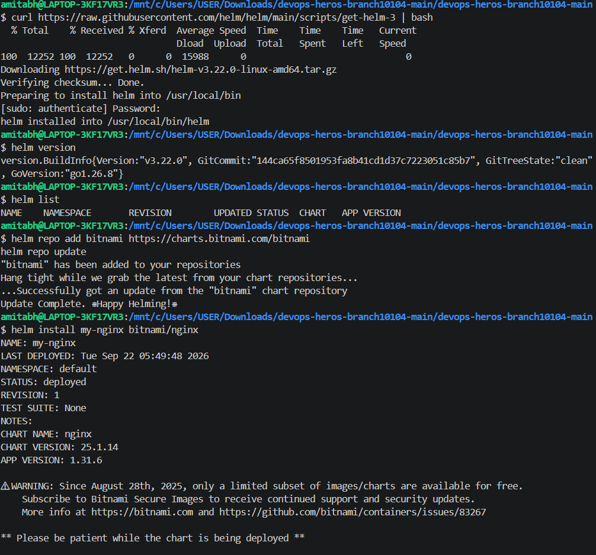

#### Verification of Deployed Resources (`kubectl get pods`, `kubectl get services`)
- After installing `bitnami/nginx`, Kubernetes creates the associated Pods and LoadBalancer service.

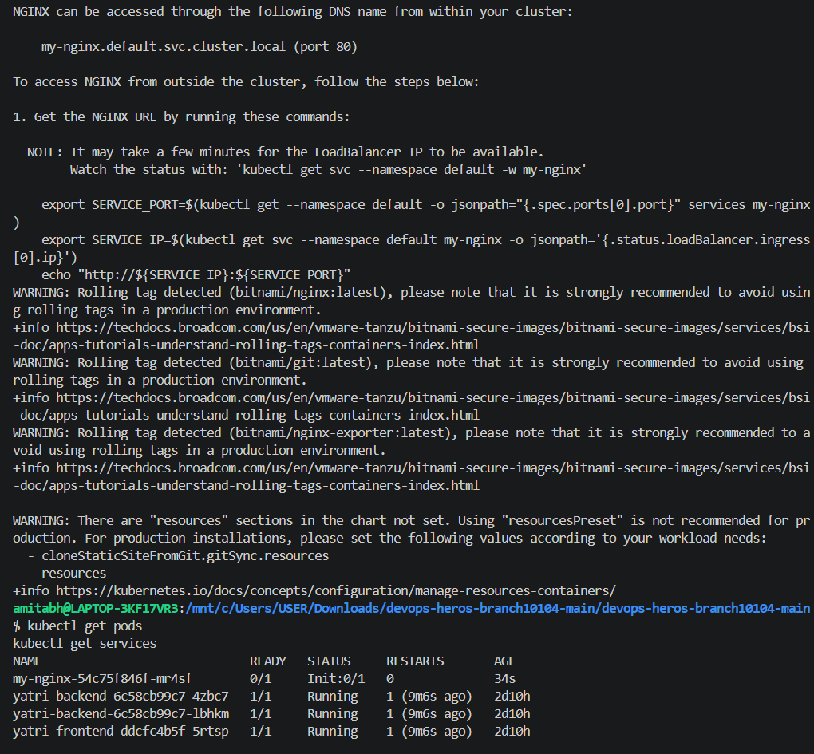

#### Removing the Release (`helm uninstall`)
- **What it does:** Uninstalls `my-nginx`, cleaning up all deployed pods and services managed by Helm.

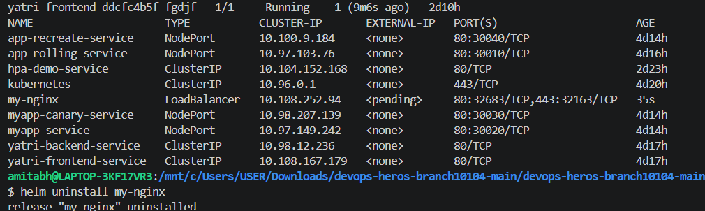

---

### 1.2 Helm Search Command (`helm search repo` / `helm search hub`)

- **What it does:**
  - `helm search repo <keyword>`: Searches through all repositories currently added via `helm repo add` (e.g., bitnami).
  - `helm search hub <keyword>`: Searches across hundreds of repositories indexed on Artifact Hub without needing to add them locally first.

```console
amitabh@LAPTOP-3KF17VR3:/mnt/c/Users/USER/Downloads/devops-heros-branch10104-main/devops-heros-branch10104-main/session-15-helm$ helm search repo nginx
NAME                            CHART VERSION   APP VERSION     DESCRIPTION                                       
bitnami/nginx                   25.1.14         1.31.6          NGINX Open Source is a web server that can also...
bitnami/nginx-ingress-controller 11.3.16        1.11.1          NGINX Ingress Controller is an Ingress controll...
bitnami/nginx-intel             2.1.15          0.4.9           DEPRECATED NGINX Open Source for Intel is a com...

amitabh@LAPTOP-3KF17VR3:/mnt/c/Users/USER/Downloads/devops-heros-branch10104-main/devops-heros-branch10104-main/session-15-helm$ helm search hub redis
URL                                                             CHART VERSION   APP VERSION     DESCRIPTION                                       
https://artifacthub.io/packages/helm/bitnami/redis              20.6.1          7.4.2           Redis(R) is an open source, advanced key-value ...
https://artifacthub.io/packages/helm/bitnami/redis-cluster      11.1.8          7.4.2           Redis(R) is an open source, advanced key-value ...
```

---

### 1.3 Chart Scaffolding & Local Template Rendering (`helm create`, `helm template`)

- **What it does:**
  - `helm create demo-chart`: Creates a boilerplate chart containing `Chart.yaml`, `values.yaml`, and sample template manifests (`deployment.yaml`, `service.yaml`, `serviceaccount.yaml`, `hpa.yaml`, `ingress.yaml`).
  - `helm template <release-name> <chart-path>`: Renders the Go templates locally using the values supplied, without interacting with the Kubernetes cluster.

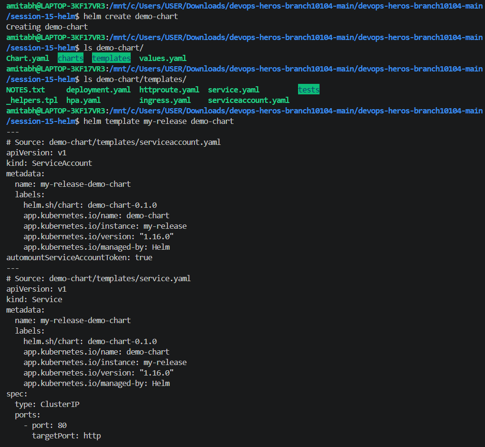

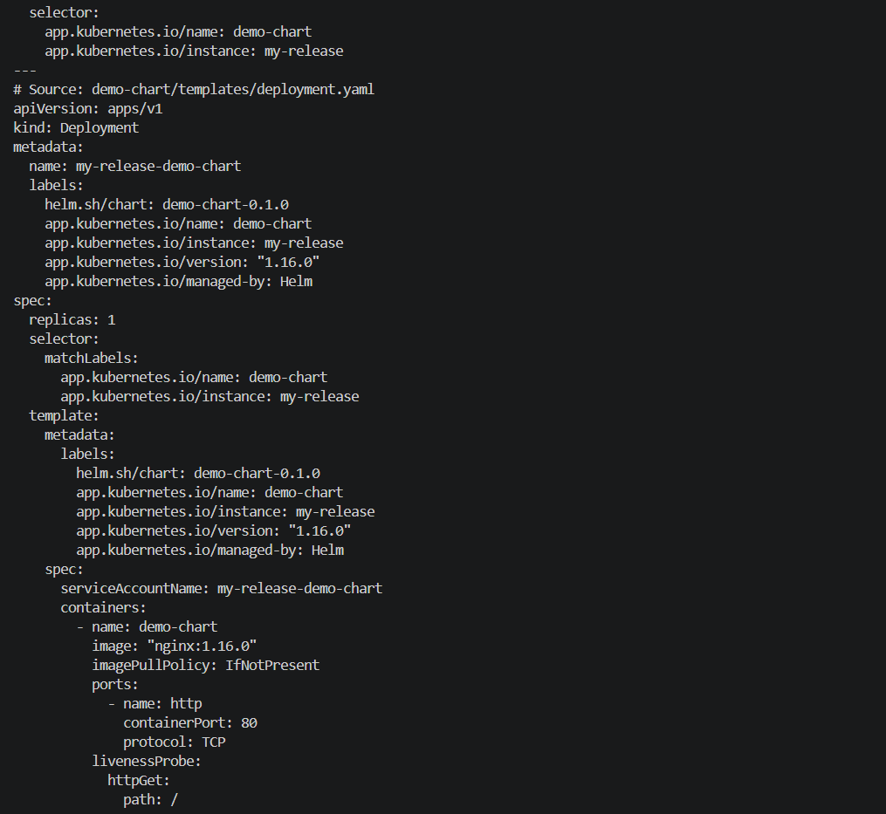

---

### 1.4 Installing a Custom Chart & Managing Lifecycle (`helm install`, `helm list`, `helm uninstall`)

- **What it does:** Deploys the newly scaffolded `demo-chart` as a release named `demo-release`.

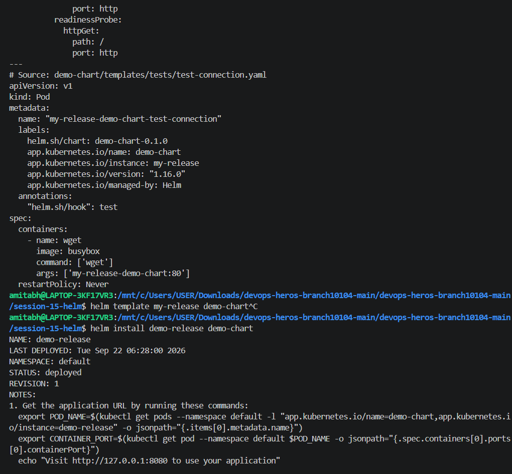

- Inspecting the release status with `helm list` and verifying cluster pods:

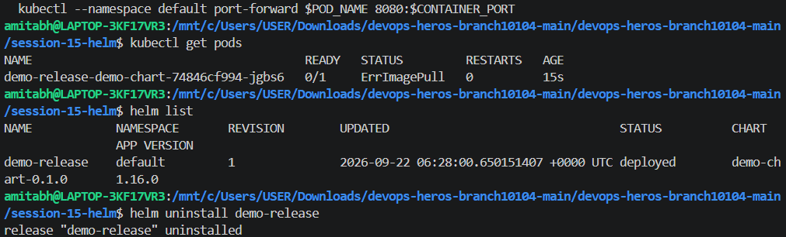

---

### 1.5 Custom Chart from Scratch (`simple-chart`)

To demonstrate the inner workings of Helm templating, a lightweight custom chart (`simple-chart`) was constructed from scratch:
- `Chart.yaml`: Defines chart metadata (`name`, `version: 0.1.0`, `appVersion: "1.0"`).
- `values.yaml`: Contains configuration parameters (`replicaCount: 1`, `image.repository: nginx`, `image.tag: latest`, `service.port: 80`).
- `templates/deployment.yaml`: Uses `{{ .Release.Name }}`, `{{ .Values.replicaCount }}`, and `{{ .Values.image.repository }}`.

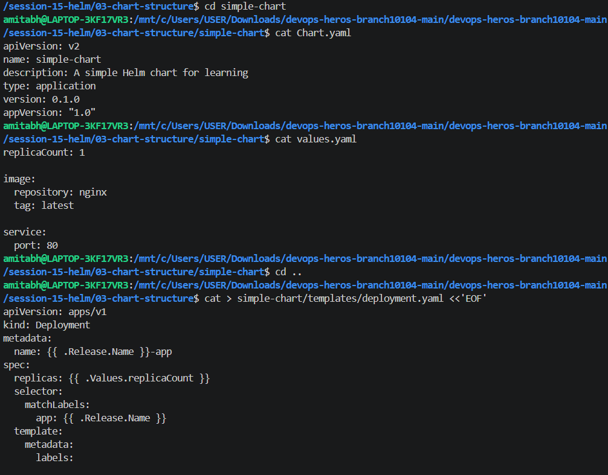

- Template creation for `deployment.yaml` and `service.yaml`:

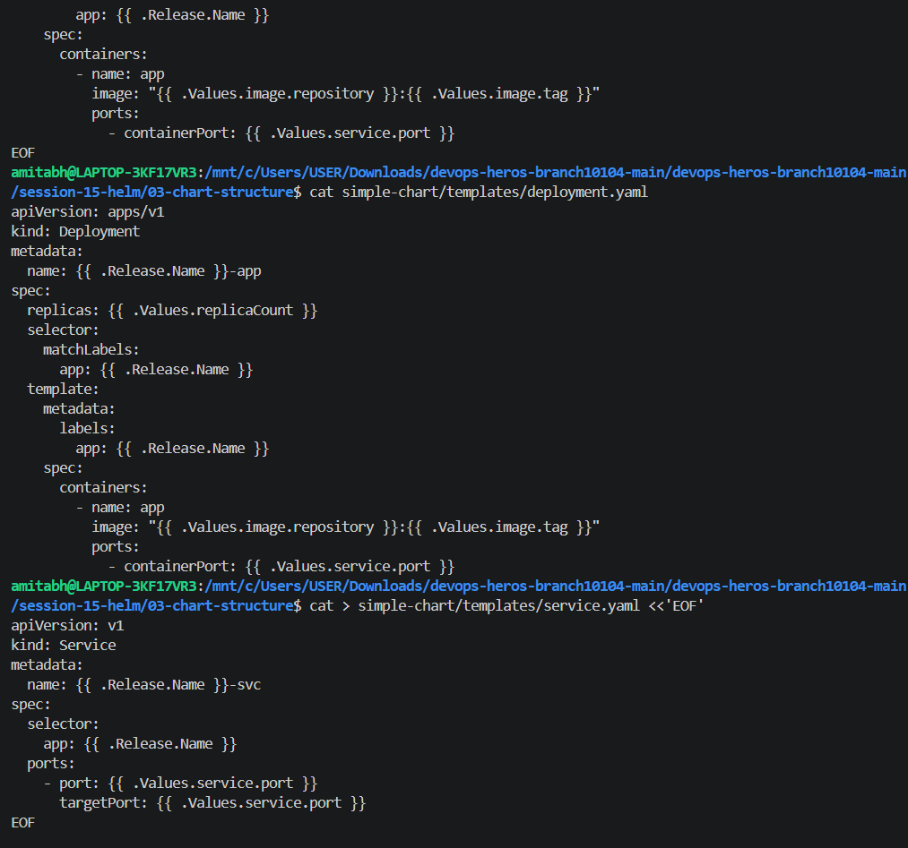

---

### 1.6 Chart Linting, Template Rendering, and Release Status (`helm lint`, `helm status`)

- **What it does:**
  - `helm lint simple-chart`: Analyzes chart syntax and verifies best practices.
  - `helm template my-release simple-chart`: Tests variable substitution locally.

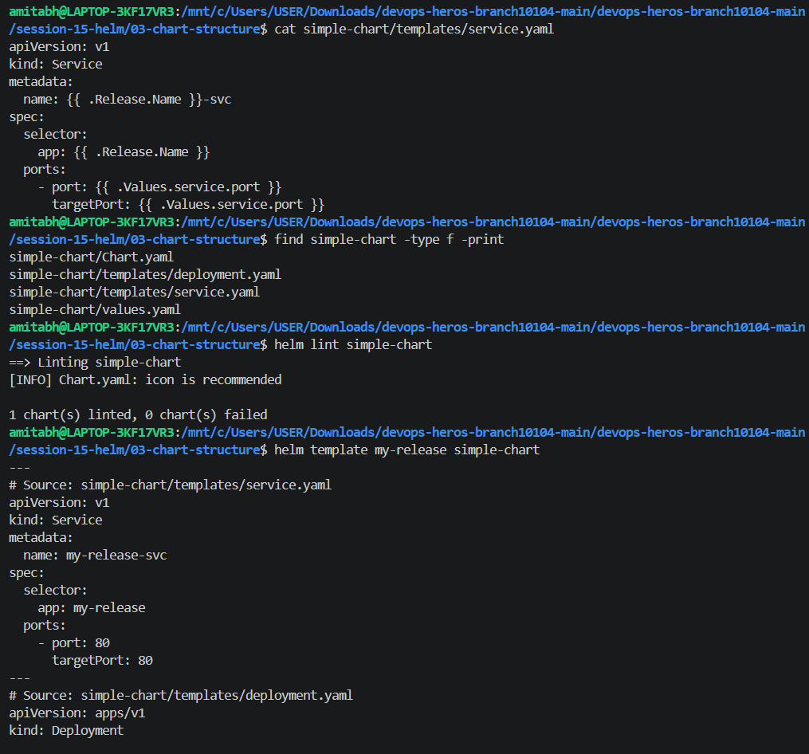

- **Deploying and Checking Status:**
  - `helm install my-release simple-chart`: Installs the chart.
  - `helm status my-release`: Fetches deployment time, namespace, status, and revision information.

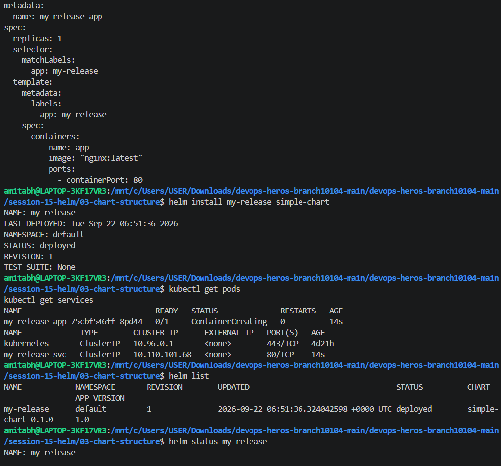

- Cleaning up `simple-chart`:

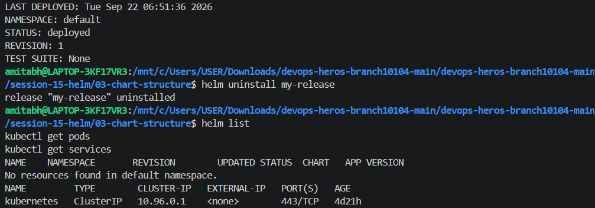

---

### 1.7 Helm Get Command (`helm get values`, `helm get manifest`, `helm get all`)

- **What it does:**
  - `helm get values <release>`: Displays user-supplied and computed values applied to a release.
  - `helm get manifest <release>`: Dumps the rendered Kubernetes manifests stored inside the Helm release secret.
  - `helm get notes <release>`: Shows instructions printed at the end of chart installation.
  - `helm get all <release>`: Combines values, manifest, hooks, and release notes in a single command.

```console
amitabh@LAPTOP-3KF17VR3:/mnt/c/Users/USER/Downloads/devops-heros-branch10104-main/devops-heros-branch10104-main/session-15-helm$ helm get values notes-dev
USER-SUPPLIED VALUES:
replicaCount: 3
image:
  repository: nginx
  tag: "1.25"
service:
  nodePort: 30090
  port: 80
app:
  environment: production
  name: notes-app

amitabh@LAPTOP-3KF17VR3:/mnt/c/Users/USER/Downloads/devops-heros-branch10104-main/devops-heros-branch10104-main/session-15-helm$ helm get manifest notes-dev | head -n 30
---
# Source: notes-chart/templates/configmap.yaml
apiVersion: v1
kind: ConfigMap
metadata:
  name: notes-dev-config
data:
  APP_NAME: "notes-app"
  ENVIRONMENT: "production"
---
# Source: notes-chart/templates/service.yaml
apiVersion: v1
kind: Service
metadata:
  name: notes-dev-svc
spec:
  type: NodePort
  selector:
    app: notes-dev
  ports:
    - port: 80
      targetPort: 80
      nodePort: 30090
```

---

# Task 2: Helm Rollback Workflow

### The Rollback Lifecycle:
$$\text{Install (v1)} \longrightarrow \text{Upgrade (v2)} \longrightarrow \text{Verify} \longrightarrow \text{Upgrade Again (v3 - Broken)} \longrightarrow \text{Verify (Failure)} \longrightarrow \text{Rollback (to v2)} \longrightarrow \text{Verify (Healthy)}$$

1. **Install (Revision 1):**
   - Deployed `notes-chart` with default values (1 replica, image `nginx:1.24`).
   ```bash
   helm install notes-dev notes-chart
   ```
2. **Upgrade (Revision 2):**
   - Upgraded to production values (3 replicas, image `nginx:1.25`).
   ```bash
   helm upgrade notes-dev notes-chart -f notes-chart/values-prod.yaml
   ```
3. **Verify:**
   - 3 pods running in healthy state.
4. **Upgrade Again - Bad Version (Revision 3):**
   - Simulating a broken release with a non-existent image tag:
   ```bash
   helm upgrade notes-dev notes-chart --set image.tag=broken-tag-does-not-exist
   ```
5. **Verify (Failure State):**
   - New pod creation enters `ErrImagePull` / `ImagePullBackOff`.
6. **Rollback to Revision 2:**
   - Executed rollback:
   ```bash
   helm rollback notes-dev 2
   ```
7. **Verify (Restored State):**
   - All 3 pods immediately recovered and running healthy.
   - `helm history notes-dev` confirms Revision 4 with description `Rollback to 2`.

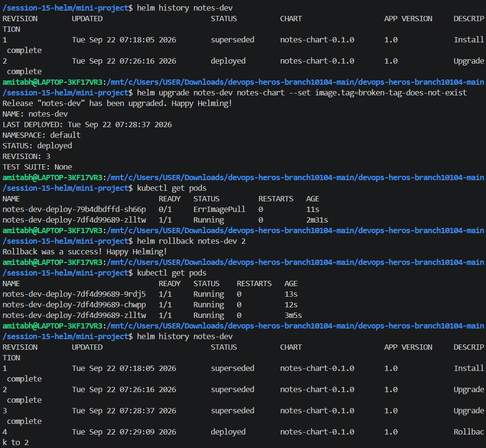

---

# Task 3: Mini Project - Notes App Helm Chart

### Project Overview
The mini project encapsulates a full Kubernetes deployment for a Notes application using a structured Helm chart located at `session-15-helm/mini-project/notes-chart`.

### Chart File Structure
```text
notes-chart/
├── Chart.yaml              # Chart metadata (version 0.1.0, appVersion "1.0")
├── values.yaml             # Development default values (1 replica, nginx:1.24)
├── values-prod.yaml        # Production values (3 replicas, nginx:1.25)
└── templates/
    ├── configmap.yaml      # Parameterized ConfigMap (APP_NAME, ENVIRONMENT)
    ├── deployment.yaml     # Deployment template with envFrom configMapRef
    └── service.yaml        # NodePort service mapping port 80 to 30090
```

### Key Deliverables Verified:
- **`Chart.yaml`**: Configured with apiVersion `v2`, chart name `notes-chart`.
- **`values.yaml` vs `values-prod.yaml`**: Multi-environment support separating development from production configurations.
- **Templates**: Dynamic resource generation utilizing Go templates (`{{ .Release.Name }}`, `{{ .Values.replicaCount }}`, `{{ .Values.app.environment }}`).
- **Testing & Rollback**: Complete upgrade cycle with bad tag simulation and rollback verified using `helm history` and `kubectl get pods`.